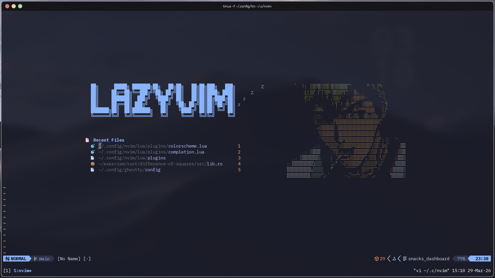
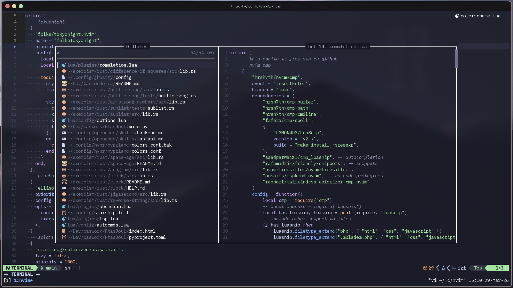
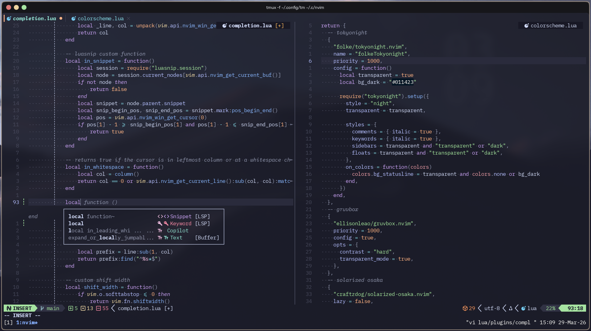
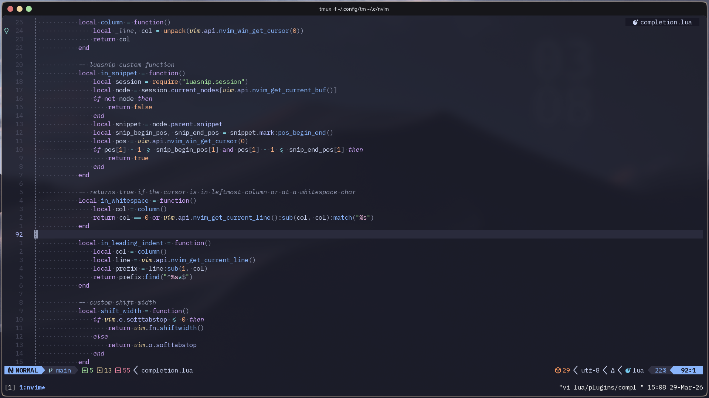
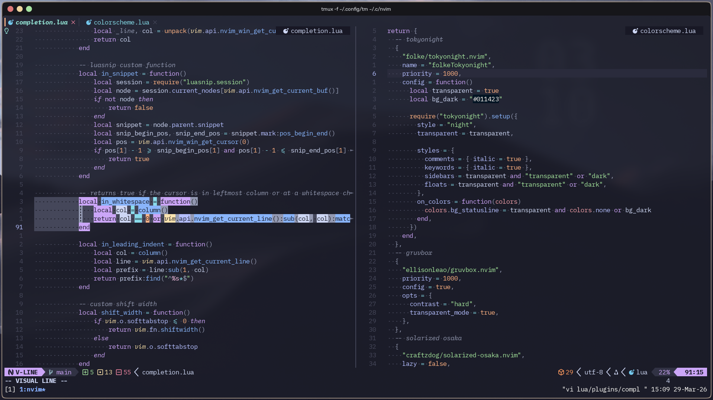

# 💤 LazyVim Configuration

A modern Neovim setup using [LazyVim](https://github.com/LazyVim/LazyVim) with a curated collection of plugins and configurations for an enhanced development experience.

### Dashboard


### Fuzzy Finder (FZF)


### Autocompletion and VSplit


### Preview


### Custom Highlighting


## Installation

Refer to the [LazyVim documentation](https://lazyvim.github.io/installation) to get started.

### Quick Start

1. Clone this configuration:
```bash
git clone https://github.com/CasienDetra/LazyVim-Config.git ~/.config/nvim
```

2. Start Neovim:
```bash
nvim
```

3. LazyVim will automatically download and install all plugins on first run.

## Configuration

The configuration is organized in the `lua/` directory with the following structure:

- `lua/config/` - Core configuration
- `lua/plugins/` - Plugin specifications
- `lazy-lock.json` - Lock file for reproducible installs

## Support

For issues or questions about LazyVim, refer to:
- [LazyVim GitHub](https://github.com/LazyVim/LazyVim)
- [LazyVim Documentation](https://lazyvim.github.io/)
